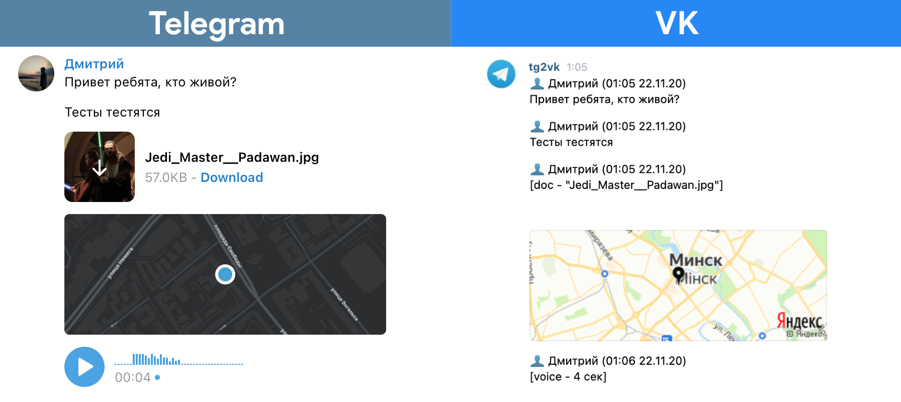

# Telegram to VK

[](https://www.python.org/)
[](https://github.com/psf/black)
[](https://app.codacy.com/gh/DiSonDS/tg2vk?utm_source=github.com&utm_medium=referral&utm_content=DiSonDS/tg2vk&utm_campaign=Badge_Grade)

Forwards messages from the Telegram chat to the VK chat



## Setup

### Prerequisites

*   Python 3.6+ ([download page](https://www.python.org/downloads/))
*   Telegram bot access token (use [BotFather](https://t.me/BotFather))
*   VK bot access token (read [VK documentation](https://vk.com/dev/access_token?f=2.%20Community%20Token))

### Installation

1.  Clone the repo
```sh
git clone https://github.com/DiSonDS/tg2vk.git
```
2.  Install PyPI packages
```sh
pip3 install -r requirements.txt
```
3.  Enter your Telegram and VK access token in `configuration.json`
```json
"tg_token": "ENTER YOUR TELEGRAM ACCESS TOKEN",
"vk_token": "ENTER YOUR VK ACCESS TOKEN",
```
4.  Start bot
```sh
python3 run.py
```
5.  Add bots to the necessary Telegram chat and to the necessary VK chat
6.  Use `/get_chat_id` command in Telegram and VK chat to find out the id of chats and enter them in `configuration.json`
```json
"tg_chat_id": ENTER_YOUR_TELEGRAM_CHAT_ID,
"vk_chat_id": ENTER_YOUR_VK_CHAT_ID,
```

## Usage

```sh
python3 run.py
```

## TODO
-   [ ] Forward messages from multiple Telegram chats to one VK chat
-   [ ] Forward messages from VK chat to Telegram chat
-   [ ] Personal emoji in the message header ([pymojihash](https://github.com/kawa-kokosowa/pymojihash))